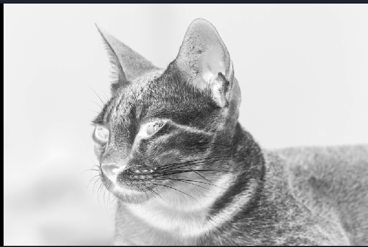
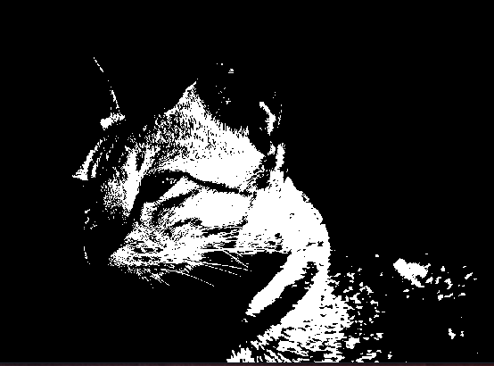
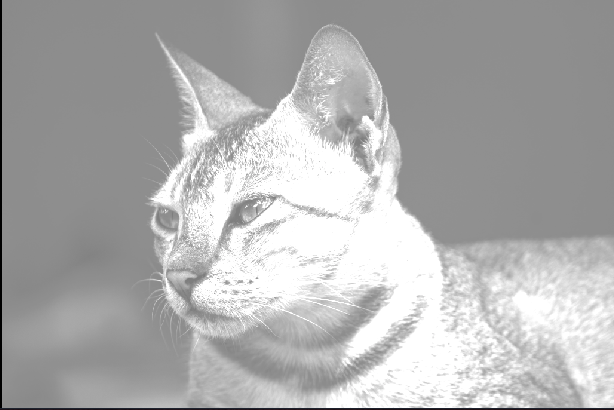
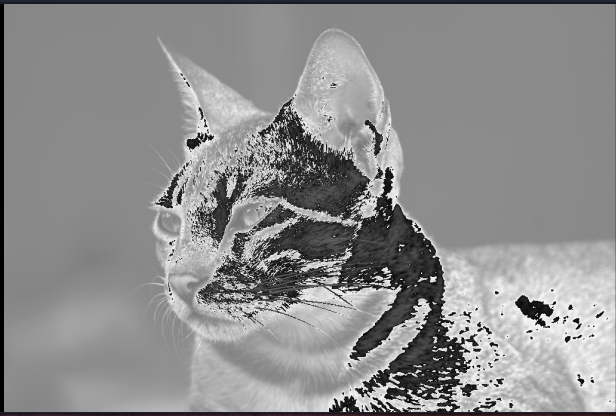
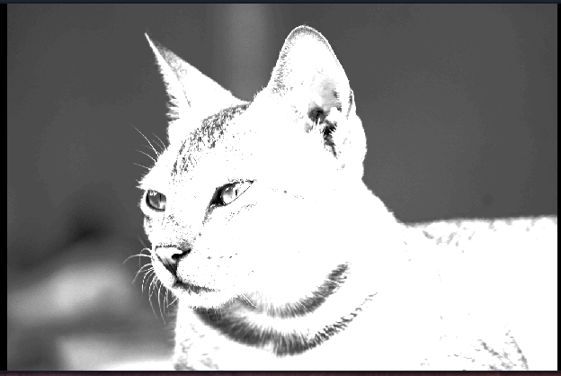
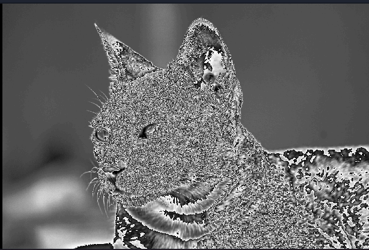

# Lab 1 - Conceitos Básicos

| Pasta           | Arquivo  |
|-----------------|----------|
| `code/01-intro` | `main.c` |

Para começar você deve clonar o repositório `https://github.com/Insper/Labs-de-C/`.

!!! info "Infra"
    Os laboratórios do mutirão foram planejados para funcionar
    no Linux, e você deve instalar os pacotes a seguir antes de começar o lab:

    - `sudo apt install build-essential libsystemd-dev`

!!! tip "Testando"
    No terminal do Linux dentro da pasta `code/01-intro` execute o comando: `make`, se tudo der certo, o programa carrega a imagem: `deepak-kumar-rX9uFci3pfY-unsplash.pgm` e gera a imagem `image-out.pgm`.

    ==Verifique se a imagem foi gerada corretamente.==

!!! progress
    Continuar...

## Começando

Não é fácil prever o quanto a linguagem C será uma novidade para vocês. Por um
lado, a sintaxe é muito parecida com Java. Por outro lado, existem diferenças
importantes e vocês estão longe de Java há mais ou menos meio semestre...

Vamos começar com a revisão de alguns conceitos bem básicos. Dê uma olhada no arquivo `main.c`:

!!! info
    - Você pode abrir o arquivo no editor de código que preferir, indicamos abrir no
    vscode.

    - Será necessário um terminal para executar o comando `make`, você pode usar o
    terminal do próprio vscode, ou do linux.

```c
#include "stdio.h"
#include "pgm.h"

#define IMG_IN  "deepak-kumar-rX9uFci3pfY-unsplash.pgm"
#define IMG_OUT "image-out.pgm"

// Esta função estará nos arquivos tarefaX.c
int process_pixel(int level) {
	int new_level;

	new_level = level;

	return new_level;
}

int main(int argc, char *argv[]) {
    PGMData image;
    readPGM(IMG_IN, &image);

    for (int x=0; x< image.row; x++){
        for (int y=0; y<image.col; y++){
            image.matrix[x][y] = process_pixel(image.matrix[x][y]);
        }
    }

    writePGM(IMG_OUT, &image);
}
```

Note que existem duas funções: `main` e `process_pixel`, a primeira é a função
que será sempre executada primeiro, a `process_pixel` é executada para cada
pixel da imagem de entrada (o gatinho).

Neste lab iremos praticar e modificar a função `process_pixel`. Essa função é trivial, mas no código já vemos vários conceitos importantes:

* as instruções terminam em ponto-e-vírgula, como em Java;

* `new_level` é uma variável da função e precisa ser *declarada* para poder ser
  usada, como em Java;

* valores e variáveis possuem *tipo*, pois C é uma linguagem com *tipagem
  forte*, como Java;

* a declaração de uma variável segue a sintaxe `tipo nome`, como em Java;

* `int` é o tipo que representa números inteiros, como em Java;

* como tipagem forte significa que *tudo*, sem exceção, tem tipo, `int` também
  aparece antes da declaração do parâmetro `level`, indicando que esse parâmetro
  é um número inteiro, e antes do próprio nome da função, indicando que
  `process_pixel` devolve um número inteiro;

* essa devolução, aliás, é feita através da instrução `return`, como em Python e
  Java;

* também em comum com Python e Java, temos o operador `=` de atribuição.

Na verdade, soa um pouco injusto ficar dizendo "como em Java" e "como em
Python", pois na verdade C veio antes de ambas!

Enfim, mesmo com a ferrugem pós-férias, vocês já devem ter percebido que essa
fantástica função faz... nada de útil. Ela apenas copia o valor do parâmetro
`level` para a variável `new_level` e devolve o valor de `new_level`. Em outras
palavras, apenas devolve o valor original de `level`, sem fazer nenhum tipo de
processamento. Yay!

Vejamos o contexto no qual essa função está sendo chamada.

~~~{.c}
for (int x=0; x< image.row; x++) {
    for (int y=0; y<image.col; y++) {
        image.matrix[x][y] = process_pixel(image.matrix[x][y]);
    }
}
~~~

Hoje vocês não precisam saber todos os detalhes desse código (isso acontecerá na
primeira aula de quarta), apenas que esses loops substituem o valor original de
cada *pixel* da imagem pelo resultado devolvido por `process_pixel`, calculado a
partir desse valor original.

Como acabamos de ver que a função simplesmente devolve o mesmo valor, então a
imagem permanece inalterada. Vamos fazer algo mais interessante?

!!! question choice
    Qual a característica da variável `int new_level`?

    - [ ] Pode assumir valores entre 0 e 4.294.967.295
    - [x] Pode assumir valores entre -2.147.483.648 e +2.147.483.648
    - [ ] É um vetor de pixels

    !!! details
        Em C possúimos alguns tipos de varíaveis, como:

        | tipo          | alternativa  | range                            |
        | -----         | ------------ | -----                            |
        | char          | int8_t       | -128 .. 127 ou 0 .. 255          |
        | unsigned char | uint8_t      | 0 .. 255                         |
        | ==int==       | ==int32_t==  | ==-2.147.483.648 .. +2.147.483.648== |
        | uint          | uint32_t     |       0 .. 4.294.967.295         |

        Para mais informações acesse: https://www.tutorialspoint.com/cprogramming/c_data_types.htm

!!! progress
    Continuar...

## Exercícios Básicos

Para todos os exercícios deste handout, sigam por favor as regras abaixo.

1. Todos os enunciados dizem **"o que"** a função deve fazer, mas não dizem **"como"**
   ela deve fazer. Essa restrição é proposital! Não pergunte "como", pois
   descobrir isso é justamente uma das habilidades que vocês precisam exercitar
   para as três disciplinas.

2. Ao terminar um exercício, chame um dos professores para testemunhar o
   programa funcionando e validar o código. Não avance no guia até fazer isso,
   para termos certeza que você está passando por todo o processo.


!!! warning ""
    Lembrete: Para cada questão, validar a resposta com a imagem referência antes de continuar

!!! warning
    Os exercícios abaixo deverão ser feitos nos arquivos `tarefaX.c`

!!! question
    O valor de um pixel é um número inteiro entre `0` e `255`. Quanto mais alto
    o valor, mais claro é o pixel. Sabendo disso, altere `process_pixel` para
    *negativizar* a imagem, ou seja, transformar pixels claros em escuros e
    vice-versa.

    > Testando:
    >
    > No terminal do Linux dentro da pasta `code/01-intro` execute o comando: `make tarefa1`, se tudo der certo, o programa carrega a imagem: `deepak-kumar-rX9uFci3pfY-unsplash.pgm` e gera a imagem `image-out.pgm`.
    >
    >  ==Você deve abrir a imagem `image-out.pgm` para ver o resultado.==
    >
    > Faça isso também para as tarefas seguintes.

    | Solução correta                          |
    |------------------------------------------|
    | {width=250} |

!!! question
    Agora altere `process_pixel` para *escurecer* a imagem: cada pixel deve
    ficar com a metade de sua luminosidade original.

    | Solução correta                          |
    |------------------------------------------|
    | {width=250} |

Antes do próximo exercício, uma dica! A sintaxe de `if/else` em C, para variar,
é como em Java. Ou seja:

~~~{.c}
    if(condição) {
        instrução
        instrução
        ...
    }
    else {
        instrução
        instrução
        ...
    }
~~~

Sabendo disso...

!!! question
    Altere `process_pixel` para receber um segundo parâmetro, também inteiro, e
    *limiarizar* a imagem:

    * se o valor original do pixel for menor que esse segundo parâmetro, seu novo
      valor deve ser `0` (preto);

    * se o valor original do pixel for maior ou igual que esse segundo parâmetro,
      seu novo valor deve ser `255` (branco).

    Não esqueça de alterar o trecho de código em que `process_pixel` é chamada,
    para evitar erros de compilação. Passe `127` como o segundo parâmetro da
    chamada. **Aqui você precisará modificar `main.c` para passar esse argumento.**

    | Solução correta                          |
    |------------------------------------------|
    | {width=250} |

!!! question
    Altere `process_pixel` para manipular o *brilho* da imagem: use o segundo
    parâmetro, adicionado no exercício anterior, como um valor que é *somado* ao
    pixel. Faça vários testes, passando múltiplos valores como o segundo
    parâmetro da chamada.

    !!! info ""
        Usando o valor 127 no segundo argumento. **Aqui você precisará modificar `main.c` para passar esse argumento.**

    | Solução correta                         |  Solução errada  |
    |------------------------------------------|---|
    | {width=250}  |  {width=250}  |

!!! question
    Altere `process_pixel` para manipular o *contraste* da imagem: use o segundo
    parâmetro como um valor que *multiplica* o pixel. Novamente, faça vários
    testes, passando múltiplos valores como o segundo parâmetro da chamada.

    !!! info ""
        Usando o valor 5 no segundo argumento. **Aqui você precisará modificar `main.c` para passar esse argumento.**

    | Solução correta                         |  Solução errada  |
    |------------------------------------------|---|
    | {width=250}  |  {width=250}  |

Nesses exercícios preliminares, vocês já usaram os operadores aritméticos
básicos (`+`, `-`, `/`, `*`), execução condicional (`if/else`) e a estrutura
básica de funções.

!!! progress
    Continuar...

## Exercícios Intermediários

Vamos agora sair do `make` por alguns instantes e fazer os próximos exercícios
"no papel", ou seja, sem ficar dependendo de rodar para ver se seu código faz
sentido. É muito importante que, pelo menos nesse começo, você não fique
excessivamente dependente do computador e da IDE. Saiba fazer pelo menos o
básico sozinho, pois isso faz muita diferença na produtividade.

!!! question short
    Como esperado, a sintaxe de `while` em C também é como em Java. Sabendo
    disso, considere o código abaixo, que calcula a soma dos números de `1` a
    `10`.

    ~~~{.c}
        int s;
        int i;

        i = 0;
        while(i < 10) {
            s += i;
            i++;
        }
    ~~~

    Ou melhor, que *deveria* calcular a soma dos números de `1` a `10`.

    1. Qual é o problema com esse código?
    1. Reescreva o código, evitando os três problemas acima.

    ??? note "Solução"

        Podemos identificar no código os três problemas abaixo.

        1. A variável `s` não é inicializada. Em Java, o valor padrão de uma variável
          `int` é `0`, mas em C essa garantia não existe! De fato, uma variável em C é
          inicializada com *lixo de memória*, ou seja, um valor baseado nos *bits* que
          já estavam escritos no pedaço de memória que foi reservado para a variável.
          Esses bits são totalmente imprevisíveis!

        2. Se a condição do `while` é `i < 10`, então o último valor de `i` somado a `s`
          é `9` e não `10`. A soma está incompleta!

        3. A variável `i` deveria ter sido inicializada com o valor `1`. A rigor, esse
          problema não torna o código *incorreto*, pois a soma de `0` é inócua, mas
          torna o código *ineficiente*, pois uma iteração é desperdiçada.

!!! question short
    Considere agora o código abaixo, que deveria calcular a *metade* da soma dos
    números de `1` a `10`.

    ~~~{.c}
      int s = 0;
      int i;

      i = 1;
      while(i <= 10) {
          s += i / 2;

          i++;
      }
    ~~~

    1. Qual é o problema com esse código?

    ??? note "Solução"
        Quando os dois parâmetros do operador `/` são inteiros, o resultado também é um
        inteiro. Se a divisão não for exata, *a parte fracionária é truncada*. Isso
        significa que o que deveria ser a soma de `0.5`, `1`, `1.5`, `2`, `2.5`, etc. é
        na verdade a soma de `0`, `1`, `1`, `2`, `2`, etc.

        Para resolver isso, precisamos primeiramente declarar `s` como `double`,
        permitindo a essa variável representar números reais... adivinhem... como em
        Java.

        ~~~{.c}
            double s = 0;
            int i;

            i = 1;
            while(i <= 10) {
                s += i / 2;

                i++;
            }
        ~~~

        Mas isso não é suficiente! Não adianta `s` poder armazenar reais se o que ela
        recebe de `/` são inteiros. Precisamos também garantir que `/` devolve um real,
        e isso acontece se pelo menos um dos dois números envolvidos na divisão é
        reconhecido como real.

        Existem duas maneiras simples de conseguir esse reconhecimento. O primeiro é
        simplesmente substituir `2` por `2.0`. A existência de uma parte fracionária,
        mesmo sendo zero, simboliza que o número é real.

        ~~~{.c}
            double s = 0;
            int i;

            i = 1;
            while(i <= 10) {
                s += i / 2.0;

                i++;
            }
        ~~~

        O segundo é fazer um *casting* de `i` para `double` antes da divisão. Lembram do
        conceito de casting? Significa pedir para o programa interpretar uma variável
        como sendo de certo tipo.

        ~~~{.c}
            double s = 0;
            int i;

            i = 1;
            while(i <= 10) {
                s += (double) i / 2;

                i++;
            }
        ~~~

        Note que um casting de `int` para `double` é praticamente inócuo, mas no casting
        de `double` para `int` perde-se a informação fracionária.
