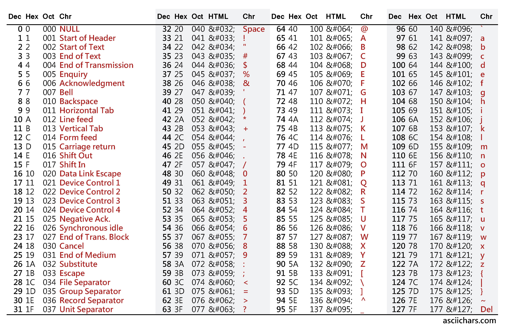

# Mutirão C 

##### Arrays, Strings e Matrizes


###### Igor Montagner, Rafael Corsi, Marcelo Hashimoto

----


# Revisão da leitura

----

## Compilação

**Compilar** um programa significa transformar o código fonte (texto) nas instruções de máquina (bytes) equivalentes.


Específico para

* arquitetura (ARM - embarcados e celulares, x64 - PCs convencionais)
* sistema operacional (Linux, Windows, Android)

----

## Comandos para compilação

**Usaremos Ubuntu 20.04 nas disciplinas Sistemas Hardware-Software e Desafios de Programação**. 

Utilização do `gcc` na linha de comando:


1. `gcc -Wall -pedantic -Og -c arq1.c -o nome_executavel` (para compilar) 
1. `./executavel` (para executar)

----

# Vetores unidimensionais

----

## Sintaxe

* Declaração:

```c
long vetor[100]; /* Tamanho FIXO */
long vetor2[] = {1, 2, 3, 4, 5}; /* Inicialização. */
```

* Acesso a elemento:

```c
scanf("%ld", &vetor[0]); /* vetor[pos] */
```

* Uso como parâmetro de função:

```c
void funcao1(long vetor[], int tamanho);
void funcao2(long vetor[100]); /* tamanho FIXO */
```

---

## Boas práticas

Evite números mágicos no seu código! Use macros!

```c
#define MAX_SIZE 100

long vec[MAX_SIZE];

...

for(i = 0; i < MAX_SIZE; i++) {
    ...
}
```

* Por que isto é uma boa ideia?

---

## Organização na memória

Os dados de um vetor são organizados sequencialmente, *sem intervalos*

```c
long A[4];
```


---

## Exemplo

```c
/* no topo do arquivo*/
#define SZ 5
/* dentro do main*/
long vec[SZ];

for (int i = 0; i < SZ; i++) {
    scanf("%ld", &vec[i]);
}

long s = 0;
for (int i = 0; i < SZ; i++) {
    s += vec[i];
}

printf("Soma eh par: %ld\n", s % 2);
```

----

## Escopo de variáveis "normais"

Qual é o resultado deste código?

```c
void soma_um(long n) {
    n += 1;
}

int main(int argc, char *argv[]) {
    long n = 10;
    soma_um(n);
    printf("%ld\n", n);
}
```

----

## Escopo de arrays

Qual é o resultado deste código?


```c
void soma_um(long arr[], long pos) {
    arr[pos]+=1;
}

int main(int argc, char *argv[]) {
    long arr[] = {1, 2, 3, 4, 5, 10};
    soma_um(arr, 5);
    printf("arr[5] %ld\n", arr[5]);
}
```

----

## Parâmetros: passagem por valor ou referência

**Passagem por valor**: `long n` é uma **cópia** do valor passado.

```c
void soma_um(long n) {
    n += 1;
}
```

**Passagem por referência**: `long arr[]` é o **mesmo objeto** da função chamadora.

```c
void soma_um(long arr[], long pos) {
    arr[pos]+=1;
}
```

----

# Strings

---

## Codificação

* Cada caractere é representado por um número inteiro de 8 bits (`char`)

* Uma string é um array de `char`

* **Tabela de Codificação**: inteiro $\rightarrow$ caractere

----



-----

## Sintaxe

**Caractere:** variável do tipo `char` que contém um inteiro da tabela ASCII. 

> `'A' == 65`, `'0' == 48`


**String:** vetor de `char` cuja última posição contém o caractere especial `'\0'`.

```c
char string[] = "bla bla bla"; /* Inicializado */
char cmd[100];  /* 99 caracteres, string inválida! */
```

----

## Organização na memória

Os dados de uma string são organizados sequencialmente, *sem intervalos*, sendo que **o último elemento é sempre o caractere `'\0'`**.

```c
char str[] = "INSPER";
```


----

## Tamanho de string

Funciona exatamente como um vetor, com a diferença que **uma string sabe seu
tamanho atual, mas não sabe seu tamanho máximo**.


```c
int string_length(char str[]) {
    int n = 0;
    while (str[n] != '\0') {
        n++;
    }
    return n;
}
```

A string não precisa ocupar todas as posições do array! Ela acaba no caractere `'\0'`.


-----

## Entrada e saída

**Impressão:**

```c
char str[10] = "world!";
printf("hello %s\n", str);
```

**Leitura**:

```c
char str[10];
// precisamos passar o tamanho máximo + 1 da nossa string. 
fgets(str, 10, stdin); 
```

<!--
## Funções da biblioteca padrão

```c
#include <string.h>

/* Tamanho da string */
size_t strlen(char *s); 

/* Devolve 0 se forem iguais,
    <0 se str1 vier antes de str2 e 
    >0 se str1 vier depois de str2 */
int strcmp(char *str1, char *str2);

/* Copia src para dest, sendo que dest deve ter
   espaço para fazer a cópia. */
char *strcpy(char *dest, char *src);
```

## Exercícios

1. Faça um programa que lê uma linha da entrada padrão e converte a primeira letra de toda palavra para maiúsculas.

1. Faça uma função `int strfind(char msg[], char tk[]);` que devolve 1 se `tk` estiver contido em `msg` e 0 caso contrário.  \pause

> **Dica**: usar strcmp ajuda?
-->

----

# Matrizes

----

## Sintaxe

* Declaração:

```c
long mat[100][200];
long mat2[2][3] = {{1, 2, 5}, {3, 4, 6}} ; 
```

* Acesso a elemento:

```c
printf("%ld\n", mat2[0][2]); /* 5 */
```

* Uso como parâmetro de função:

```c
void funcao1(long vetor[100][200]);
```

É obrigatório colocar a última dimensão! A primeira é facultativa, mas recomendamos colocar também.

----

## Organização na memória

Os dados de uma matriz são armazenados *linha a linha*

```c
long mat[2][3];
```


**É preciso conhecer a segunda dimensão para acessar os elementos!**

-----

# Exercícios

Os exercícios da seção final do Lab 4 são mais avançados e representam o nível esperado de complexidade ao fim do mutirão. Não deixe de fazê-los!
